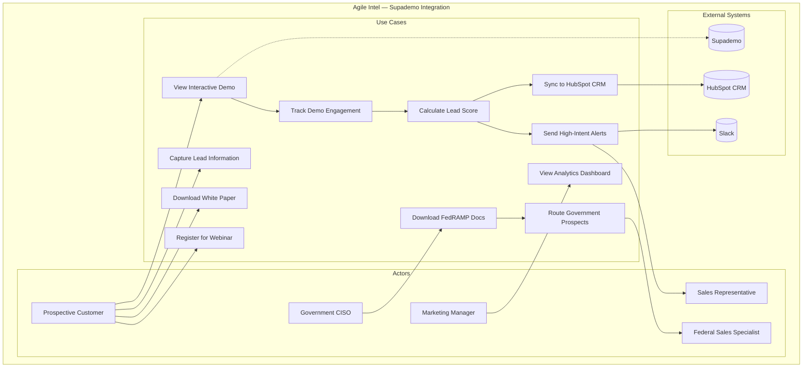
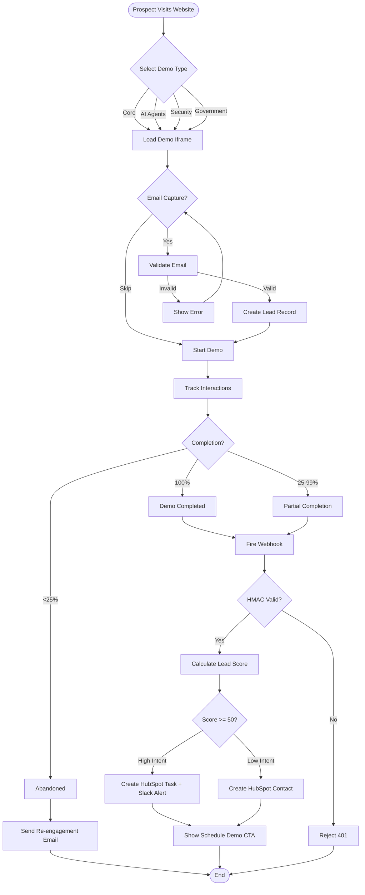
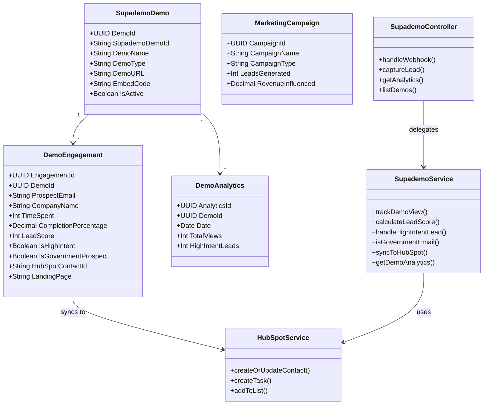
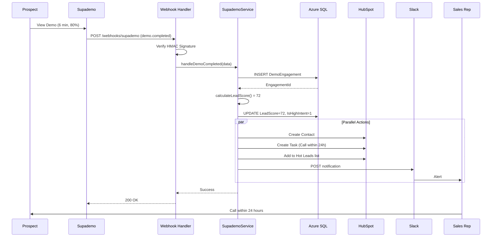
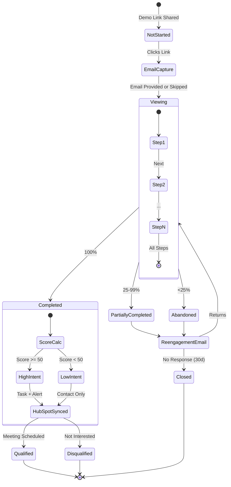
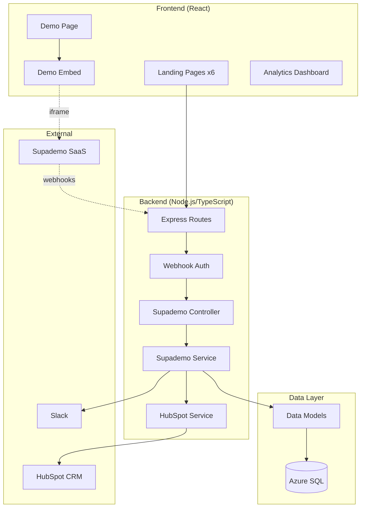
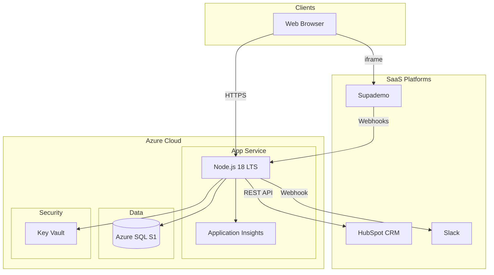

# UML Diagrams — Supademo Integration v2.0

All diagrams in Mermaid format. Render at https://mermaid.live or in any Mermaid-compatible viewer.

---

## 1. Use Case Diagram

---

## 2. Activity Diagram — Demo Viewing Flow

---

## 3. Class Diagram

---

## 4. Sequence Diagram — High-Intent Lead Flow

---

## 5. State Machine Diagram — Engagement Lifecycle

---

## 6. Component Diagram

---

## 7. Deployment Diagram

